# CFD Simulation of a 90° Pipe Bend – Power Loss Analysis

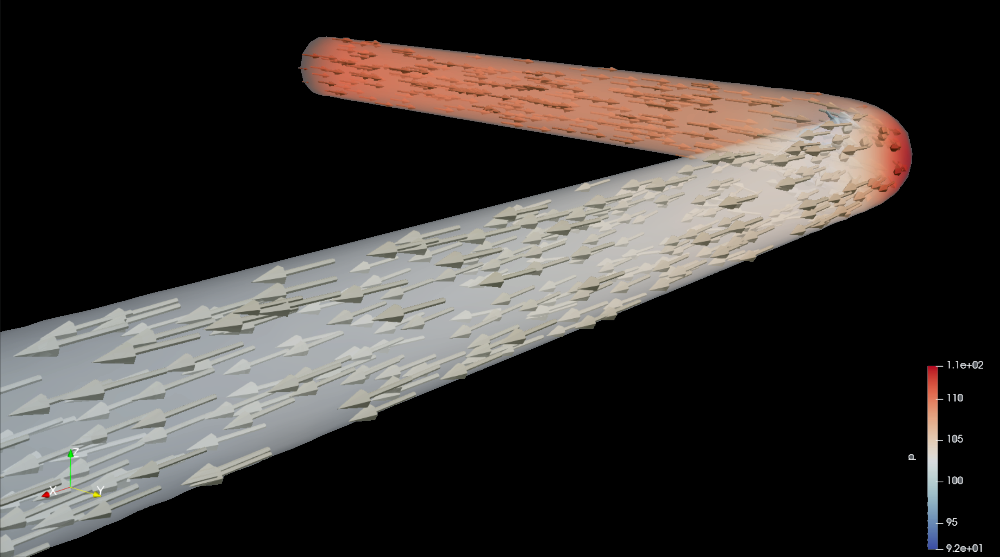

## Abstract
This project investigates the pressure drop and power loss in a smooth 90° pipe bend using free and open-source software.  
A complete CAD → Mesh → CFD → Post-processing workflow was implemented:

1. **FreeCAD** – 3D modeling of the pipe bend geometry.  
2. **Salome** – Mesh generation, defining inlet, outlet, and wall groups.  
3. **OpenFOAM v12** – Steady-state RANS simulation (simpleFoam) with the kOmegaSST turbulence model.
4. **ParaView** – Post-processing, visualization, and pressure integration.

**Key results:**
- **Fluid:** Water (ρ = 1000 kg/m³, ν = 1e-6 m²/s)  
- **Flow velocity (inlet):** 5 m/s  
- **Theoretical inlet/outlet area:** 0.000314 m² (r = 20 mm)  
- **Simulated mesh area:** 0.00030207 m²  
- **Pressure drop:** 9.098 J/kg (≈ 9.1 kPa)  
- **Power loss:** 14.28 W (theoretical area), 13.74 W (simulated area)  
- **Reynolds number:** 100,000  
- **Loss coefficient (K):** 0.728  
- **Convergence:** 13,500 iterations  

---

## Workflow

### 1. Geometry creation in FreeCAD
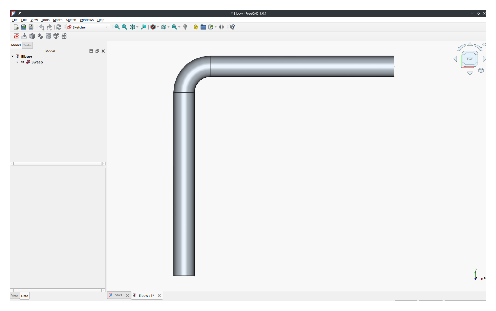

### 2. Meshing in Salome with inlet/outlet/wall groups
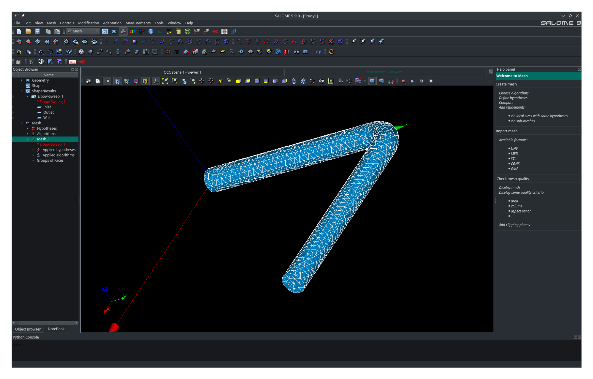

### 3. Turbulence parameter calculation
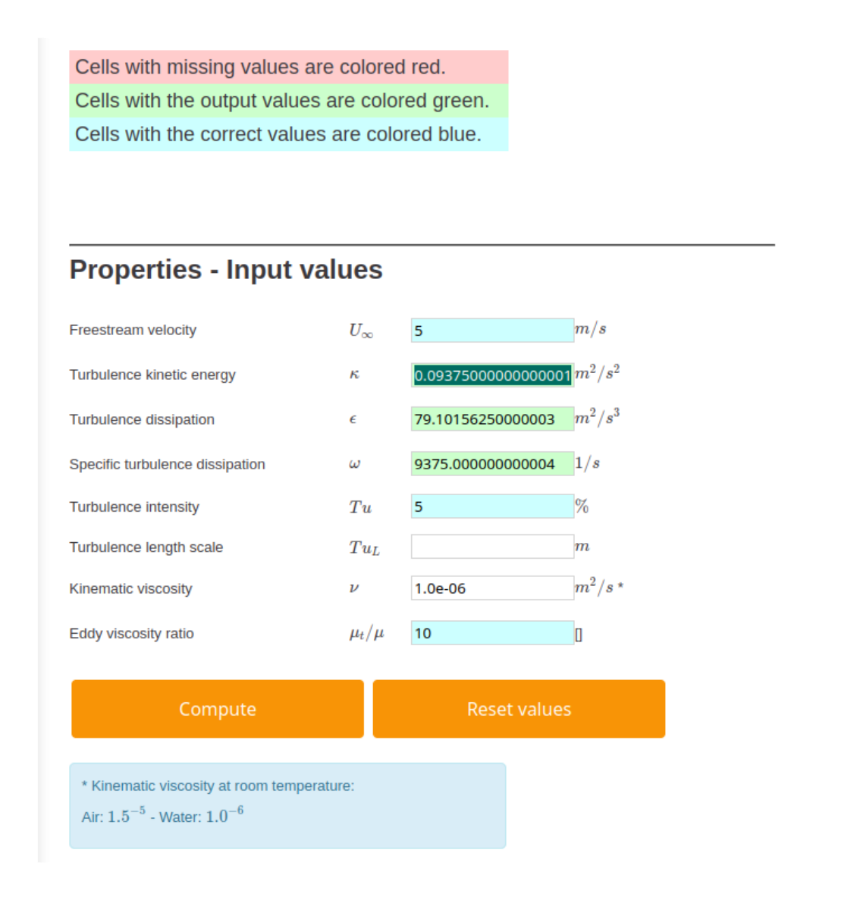

Inputs: Turbulence intensity 5%, eddy viscosity ratio 10, free-stream velocity 5 m/s.  
Outputs: Turbulence kinetic energy (k), dissipation rate (ε), and specific dissipation rate (ω).

### 4. Running the simulation in OpenFOAM
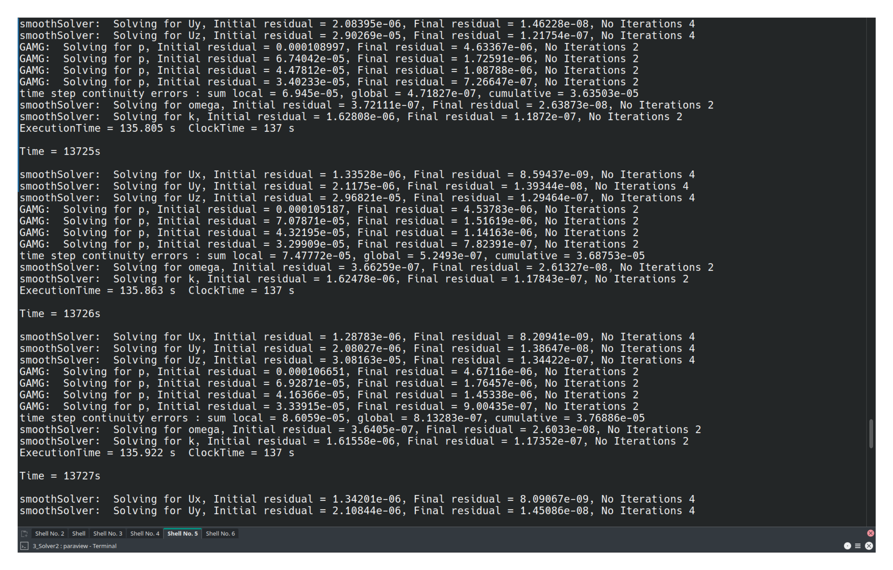

---

## Post-processing (ParaView)

### Importing simulation data

### Solid color geometry
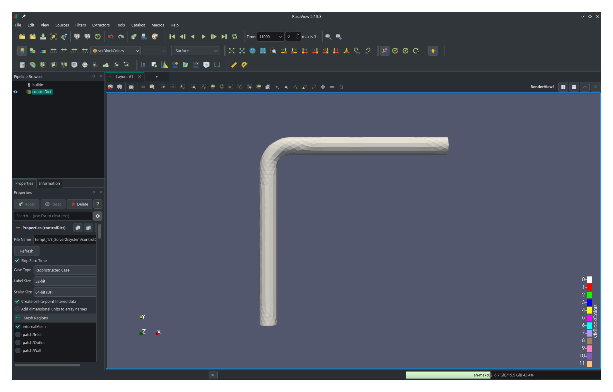

### Pressure drop visualization
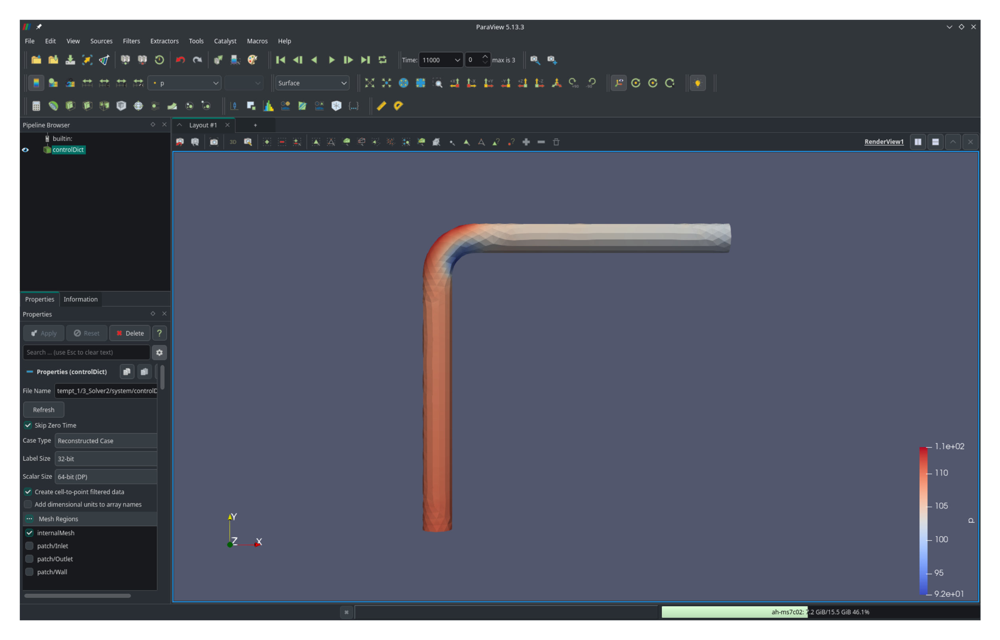

### Velocity gradient visualization
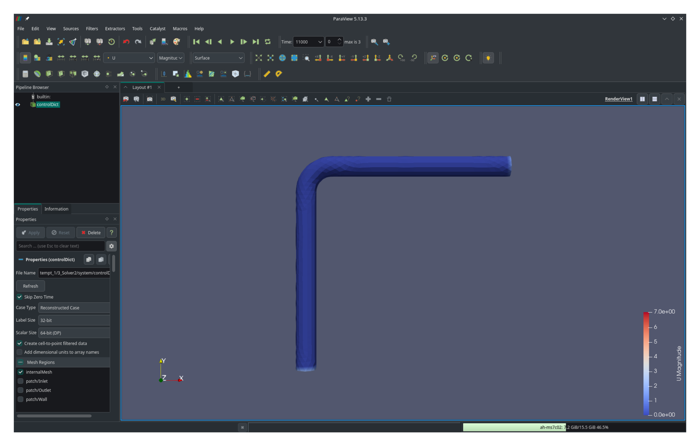

### Cross-section: XY plane pressure profile
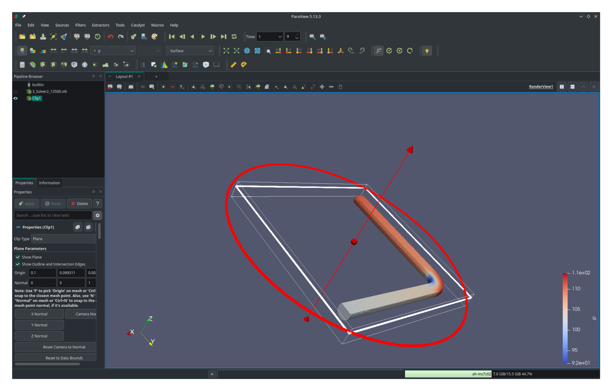

### Cross-section: velocity magnitude & direction (glyphs)
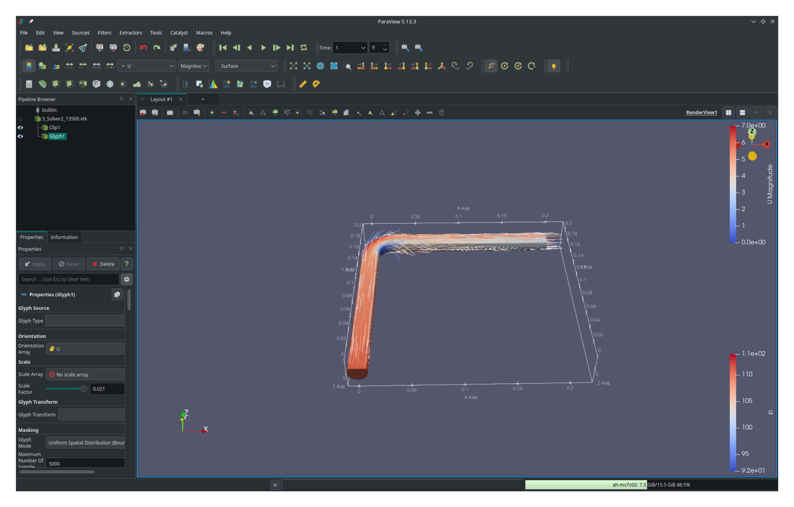

### Inlet average pressure calculation
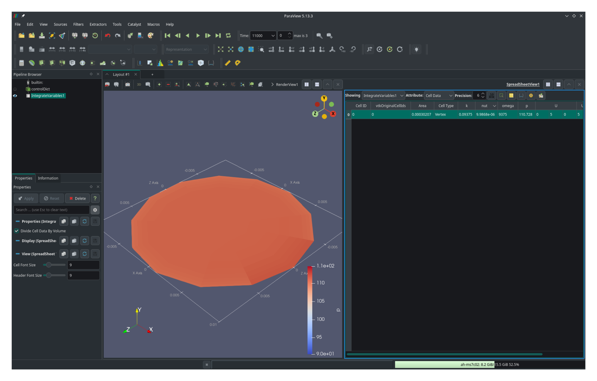

### Outlet average pressure calculation
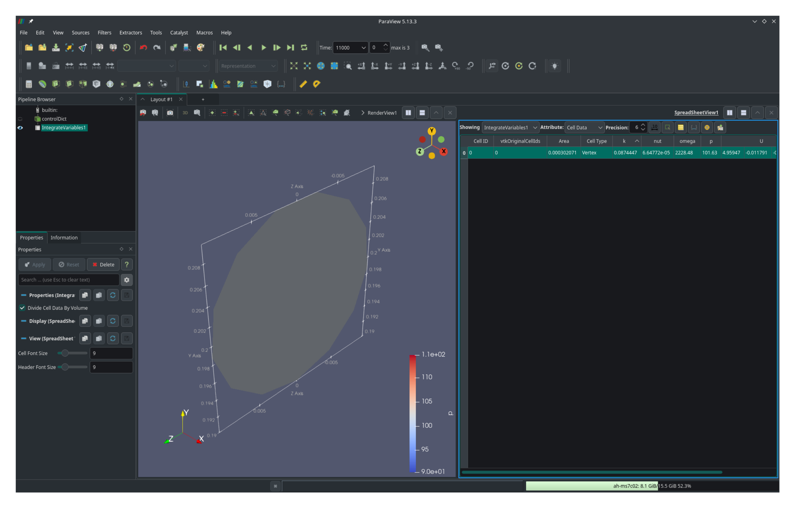

### Pressure profile with large arrow glyphs

### Velocity profile with small arrow glyphs
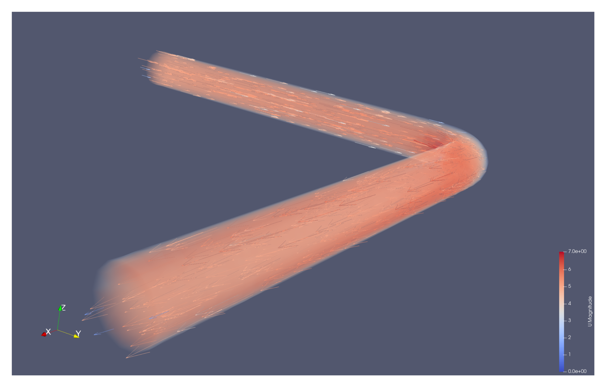

---

## Results Summary

| Parameter                        | Value            |
|-----------------------------------|------------------|
| Flow velocity (U)                | 5 m/s            |
| Fluid density (ρ)                 | 1000 kg/m³       |
| Kinematic viscosity (ν)           | 1e-6 m²/s        |
| Theoretical area                  | 0.000314 m²      |
| Simulated mesh area               | 0.00030207 m²    |
| Pressure drop (Δp)                | 9.098 kPa        |
| Power loss (theoretical area)     | 14.28 W          |
| Power loss (simulated area)       | 13.74 W          |
| Reynolds number                   | 100,000          |
| Loss coefficient (K)              | 0.728            |

---

## License
This project is licensed under the GNU General Public License v3.0 (GPL-3.0).  
See the [LICENSE](./LICENSE) file for the complete text.

---
